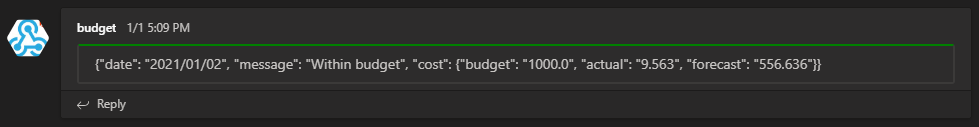
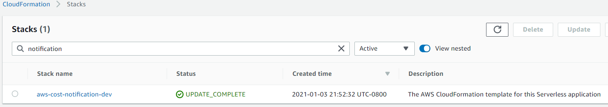
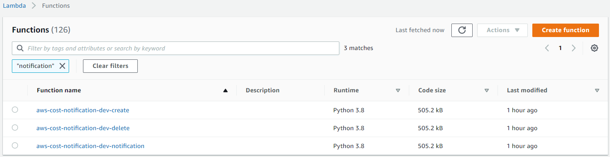

# AWS Cost Notification for Serverless Framework using Python 3
Lambda function of **AWS cost notification** into Microsoft Teams incoming webhook
(python based)



## Index
<!-- TOC -->

- [AWS Cost Notification for Serverless Framework using Python 3](#aws-cost-notification-for-serverless-framework-using-python-3)
	- [Index](#index)
- [How to deploy](#how-to-deploy)
	- [Setup: AWS Credentials on your PC](#setup-aws-credentials-on-your-pc)
	- [Setup: Serverless Framework on your PC](#setup-serverless-framework-on-your-pc)
	- [git clone](#git-clone)
	- [Update: config](#update-config)
	- [Create a service directory](#create-a-service-directory)
	- [Deploy a service](#deploy-a-service)
	- [Debug: Create & Delete AWS Budget](#debug-create--delete-aws-budget)
	- [Delete a service](#delete-a-service)
	- [Deployment logs](#deployment-logs)
- [Check: AWS Console](#check-aws-console)
	- [AWS CroudFormation](#aws-croudformation)
	- [AWS Lambda](#aws-lambda)

<!-- /TOC -->

# How to deploy

## Setup: AWS Credentials on your PC
```
$ cat ~/.aws/credentials 
[default]
aws_access_key_id= [Your ID]
aws_secret_access_key= [Your Key]
aws_session_token= [Your Token]
region= [Your AWS Region (eg: us-east-1)]
```

## Setup: Serverless Framework on your PC
```
$ python -V
Python 3.7.9

$ pip3 -V
pip 9.0.3 from /usr/lib/python3.7/site-packages (python 3.7)

$ npm -v
6.14.8

$ npm install -g serverless
...

$ sls -v
Framework Core: 2.17.0
Plugin: 4.4.1
SDK: 2.3.2
Components: 3.4.3
```

## git clone
```
$ git clone https://github.com/YuyaIsoda/aws_cost_notification.git
```

## Update: config
Please **MUST** set:
- **Region**: AWS Region Name
- **AccountId**: AWS Acount ID
- **NtEmail**: Your email address
- **MSTeamsUrl**: Microsoft Teams Webhook URL

```
$ cat aws_cost_notification/conf/sls_conf
# Serverless Framework: Settings
export ServiceName='aws-cost-notification'
export SLSDIR='serverless'
export Region='us-east-1'
export Stage='dev'

# Environment variable
export AccountId='123456' # Your AWS Account ID
export BudgetName='aws-cost-notification'
export LimitUSD='1000' # Budget Limit
export NtThreshold='80' # Budget Threshold [%] for noification
export NtEmail='sample1234@gmail.com' # Your email address
export MSTeamsUrl='https://outlook.office.com/webhook/xxxx' # Your Microsoft Teams Webhook URL
```

## Create a service directory
```
$ cd aws_cost_notification/common/
$ sh sls_create.sh
...
```

## Deploy a service
```
$ cd ~/serverless/aws-cost-notification/
$ sh sls_deploy.sh 
...
Service Information
service: aws-cost-notification
stage: dev
region: us-east-1
stack: aws-cost-notification-dev
resources: 14
api keys:
  None
endpoints:
  None
functions:
  notification: aws-cost-notification-dev-notification
  create: aws-cost-notification-dev-create
  delete: aws-cost-notification-dev-delete
layers:
  None
```

## Debug: Create & Delete AWS Budget
```
$ cd ~/serverless/aws-cost-notification/
$ source bin/activate
$ source sls_conf

$ sls invoke -f create --log
... (No Error)

$ sls invoke -f notification --log
... (No Error)

$ sls invoke -f delete --log
... (No Error)
```

## Delete a service
```
$ cd ~/serverless/aws-cost-notification/
$ sh sls_remove.sh 
...
```

## Deployment logs
```
$ ll ~/serverless/log/
total 56
-rw-rw-r-- 1 ec2-user ec2-user 3069 Jan  2 05:19 aws-cost-notification_us-east-1_20210102_051937.yml
-rw-rw-r-- 1 ec2-user ec2-user 6304 Jan  2 05:22 aws-cost-notification_us-east-1_20210102_051940_deploy.log
-rw-rw-r-- 1 ec2-user ec2-user  269 Jan  2 05:58 aws-cost-notification_us-east-1_20210102_055732_remove.log
...
```

# Check: AWS Console
## AWS CroudFormation


## AWS Lambda

